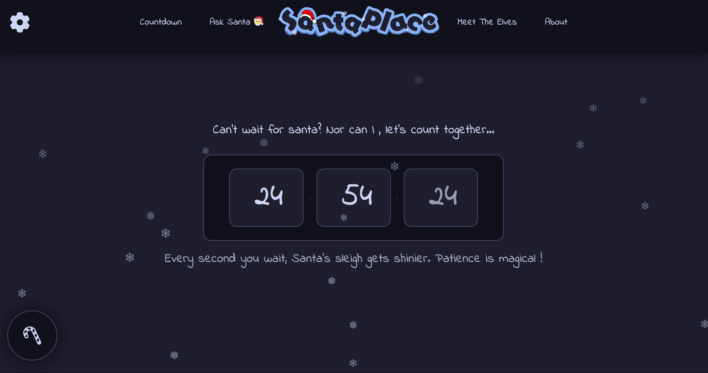
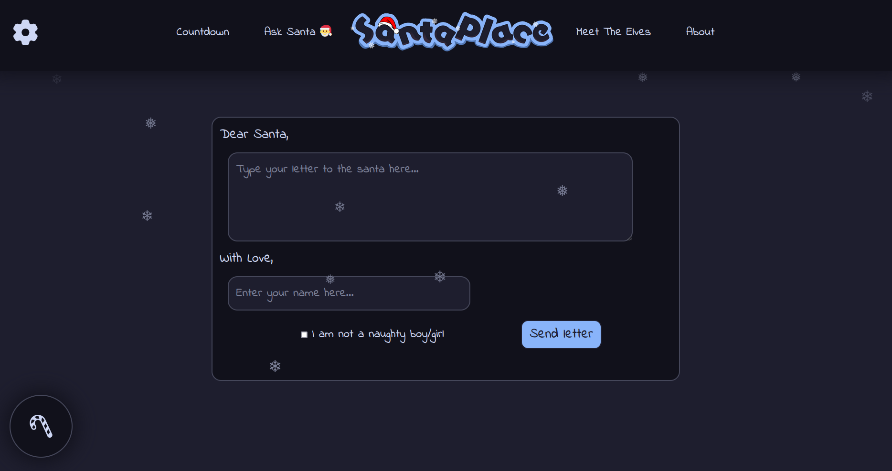
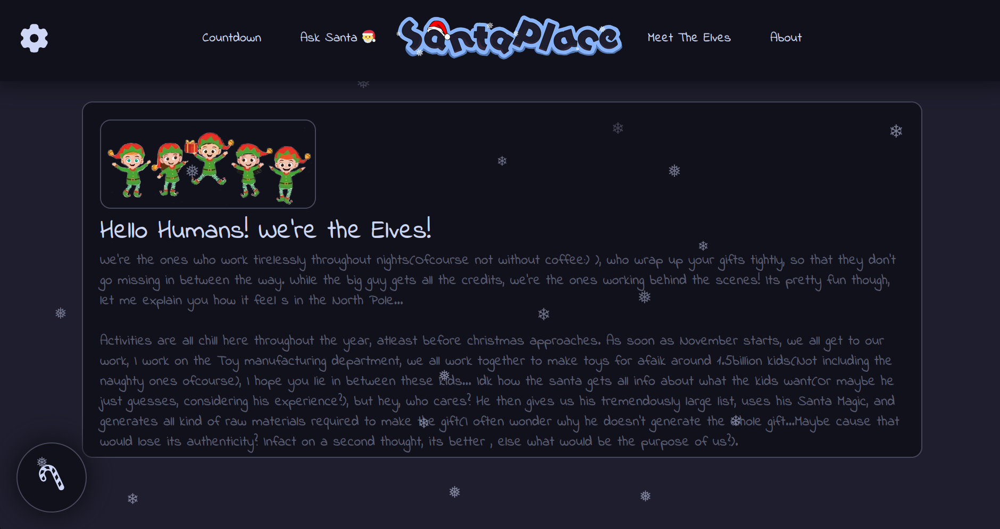
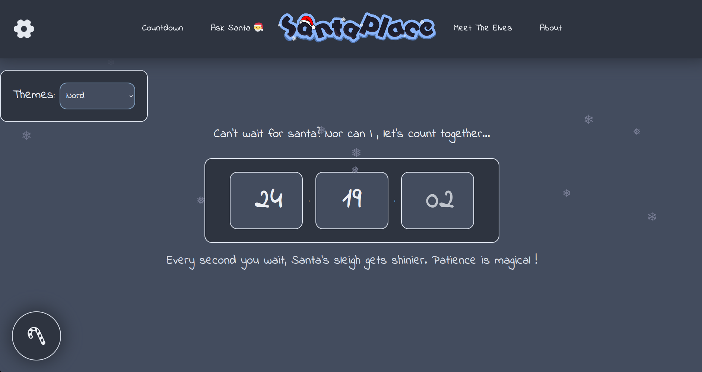

# SantaPlace🎅
A simple static website to display a christmas countdown and many more activites that elves probably like:)

## ✨ Demo 
[Live Here](https://shibamroy9826.github.io/SantaPlace/)

## Screenshots📷

## Features 😎
- Theme customizability
- Responsive
- Send a letter to santa (Don't ask me how I know his information)
- Christmas countdown
- Elf's message...

## How is it made?

Its a pretty simple project made with HTML, and vanilla CSS and Javascript. If you clicked on that candy button in the website, the audio that plays up is actually [this](https://youtu.be/3CWJNqyub3o?si=12e25EcsRUDQZi2O) youtube video. Thanks to its creators that this was possible. This project is a part of the [Boba Drops](https://boba.hackclub.com/) organised by [Hackclub](https://hackclub.com/).

## Contributing 🤝

Everyone is welcome to contribute to the code!
You can also raise an issue, or suggest any features that you think would be great :)

> ✨ Please star this repository if you liked this project 😁
